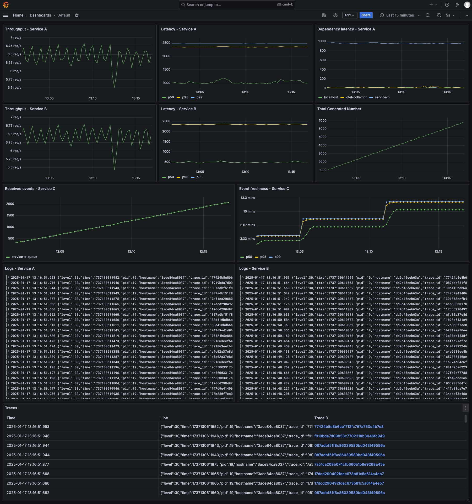
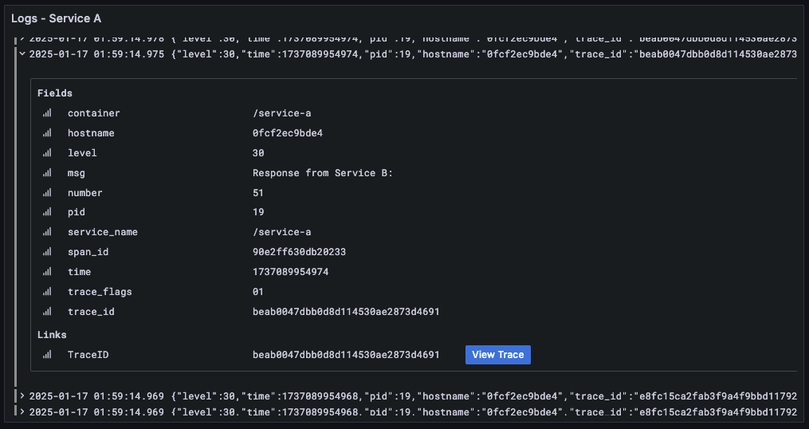
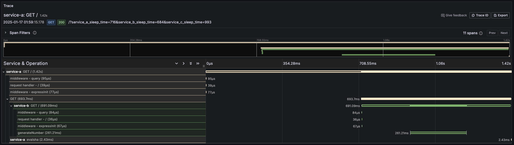
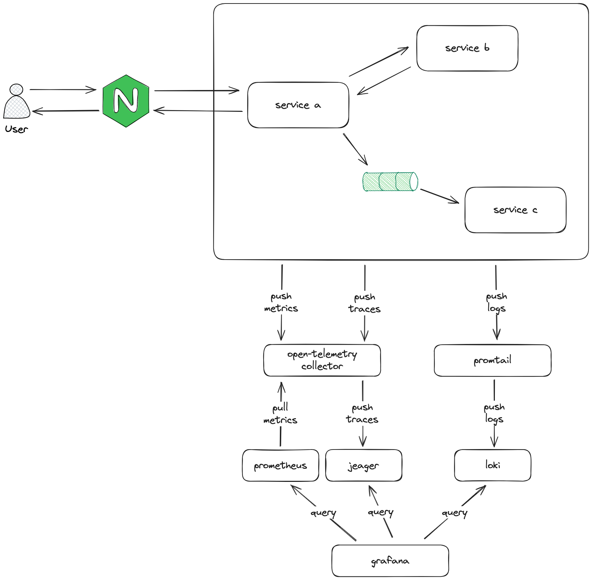

# Observability with OpenTelemetry and Loki

This project demonstrates the integration of OpenTelemetry and Loki for observability in modern applications. It provides examples of distributed tracing, metrics collection, and centralized logging.

## Table of Contents

- [Observability with OpenTelemetry and Loki](#observability-with-opentelemetry-and-loki)
  - [Table of Contents](#table-of-contents)
  - [Description](#description)
  - [Features](#features)
  - [Requirements](#requirements)
  - [Setup and Execution](#setup-and-execution)
    - [Clone the Repository](#clone-the-repository)
    - [Start the Project](#start-the-project)
    - [Explore](#explore)
  - [Architecture](#architecture)
    - [Overview](#overview)
    - [Diagram](#diagram)
  - [Next steps](#next-steps)
  - [License](#license)

## Description

This repository showcases a practical example of implementing observability using:

- **OpenTelemetry** for metrics and tracing.
- **Loki** for centralized logging.
- **Grafana** for exploring and visualizing.

The goal is to provide a comprehensive setup that integrates these tools to improve monitoring and troubleshooting in applications.

## Features

- Metrics collection via OpenTelemetry.
- Distributed tracing for better request flow visualization.
- Centralized logging with Loki.
- Grafana integration.
- K6 load generation.
- Examples and configurations for easy adoption.

## Requirements

- **Docker** and **Docker Compose**.

## Setup and Execution

### Clone the Repository

```bash
git clone https://github.com/pcandido/observability-otel-loki.git
cd observability-otel-loki
```

### Start the Project

Using Docker Compose:

```bash
docker-compose up
```

### Explore

Browse to [localhost:8081](http://localhost:8081) and find the Default dashboard.
The default username and password is `admin` and `admin` respectively.

Use Grafana Explore to try new visualization by yourself and feel free to create new dashboards.





## Architecture

### Overview

The ecosystem is composed by three trivial micro-services.

* **service-a** receives a request, make a synchronous (http) request to service-b and enque a message to service-c.
* **service-b** is an internal service that generates a random number and respond to the caller
* **service-c** is an internal service that consumes an asynchronous queue

To monitor/observe this ecosystem, those three services push metrics and tracings to an otel-collector and logs to the promtail.

The otel-collector pushes the tracings to the Jeager and provide an interface to be scraped (pulled) by Prometheus.

Promtail pushes the received logs to Loki.

Grafana connects on Prometheus, Jeager and Loki to fetch and query metrics, tracings and logs respectively.

Check the following diagram out to see the whole ecosystem and the connections.

### Diagram



## Next steps

- Monitor Nginx and node (host) as done in [the first version](https://github.com/pcandido/observability).

## License

This project is licensed under the [MIT License](LICENSE).
